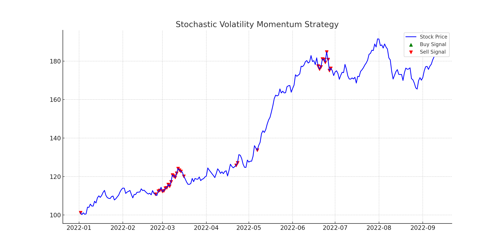

# Stochastic Volatility Momentum Strategy (SVMS)

A quantitative trading strategy that combines the principles of the Heston stochastic volatility model with momentum indicators to generate buy/sell signals.

## Overview

Financial markets often exhibit periods of low and high volatilities. The SVMS strategy aims to exploit these patterns by combining:

- **Heston Model**: A stochastic volatility model that allows for a dynamic volatility path.
- **Momentum Indicators**: Used to capture the momentum in the asset price, indicating potential buy/sell opportunities.

## Models and Indicators

### Heston Stochastic Volatility Model

The Heston model captures the dynamics of an asset's price and its volatility. The model uses two stochastic differential equations: one for the asset price and another for its variance.

### Relative Strength Index (RSI)

RSI is a momentum oscillator that measures the speed and change of price movements. It oscillates between 0 and 100 and is typically used to identify overbought or oversold conditions.

## Buy/Sell Signal Plot



## Requirements

- Python 3.x
- NumPy
- pandas
- Matplotlib

## How to Execute

1. Ensure you have all the required libraries installed.
2. Clone the repository or download the `svms_strategy.py` script.
3. Execute the script:
```
python svms_strategy.py
```
4. The script will generate a visualization of the stock price, volatility, and buy/sell signals.

## Contributing

Pull requests are welcome. For major changes, please open an issue first to discuss what you would like to change.

## License

[MIT](https://choosealicense.com/licenses/mit/)

